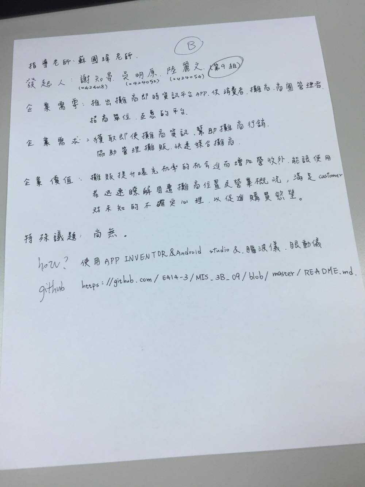

# MIS_3B_09
---
## 指導老師：蘇國瑋
## 發起人：0424018謝知晏、0424052吳明原、0424054陸麗文
### 專案理由：推出攤商及時資訊平台APP，使消費者、攤商、商圈管理者及招商單位互惠的平台。
### 專案功能：獲取及時姓攤商資訊，幫助攤商行銷與協助管理攤販快速媒合攤商。
### 預期效益：攤販提升曝光機率的機會進而增加營收外，能讓使用者迅速了解周遭攤商位置及營業概況，滿足顧客對未知的不確定心理，以促進購買欲望。
### 特殊議題：尚無
### 使用工具：使用APP INVENTOR、Android Studio、腦波儀、眼動儀。
### GitHub：https://github.com/E414-3/MIS_3B_09/blob/master/README.md
--- 

---
#### 功能性需求
#### 1.可再通知列快速使用APP功能
#### 2.設計我的最愛功能讓使用者能快速紀錄喜愛攤商
#### 3.細分種類，用戶能夠迅速找到想要的攤商
---
#### 非功能性需求
#### 1.系統應該能夠即時更新用戶資料
#### 2.用戶的個資只有在合理的範圍內才可被使用
#### 3.系統應該能夠整合資料庫及其應用
